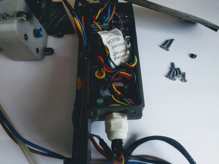
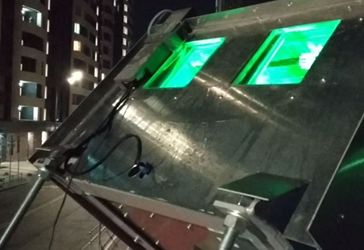

# Outdoor Lasers - Cleaning Robot Project

This is the custom project of the cleaning robot developed in 2018-2019 for the startup Outdoor Lasers. The primary purpose of this project is to make the front glasses clean to keep the intensity of lasers at 100% due to the weather and outside world.

 